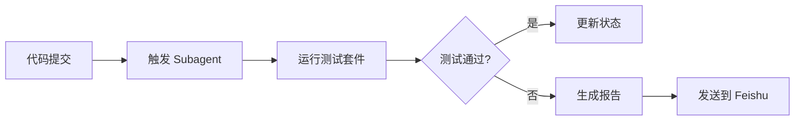

# TestClaude 团队 Agent 支持设计文档

**版本**: v1.0  
**创建时间**: 2026-03-23  
**状态**: 设计草案

---

## 一、设计目标

为 TestClaude 团队建立完整的 Agent 支持体系，实现：
1. **自动化测试** - Agent 自动执行测试用例
2. **智能代码审查** - 自动分析 PR 质量
3. **任务编排** - 多 Agent 协作完成复杂任务
4. **持续集成** - 与 GitHub Actions 集成

---

## 二、Agent 架构

### 2.1 Agent 类型

| 类型 | 用途 | 运行时 | 生命周期 |
|------|------|--------|----------|
| **Subagent** | 临时任务 (测试、分析) | `runtime: subagent` | 一次性 (run) |
| **ACP Agent** | 编码代理 (Codex/Claude Code) | `runtime: acp` | 持久会话 (session) |
| **Skill Agent** | 特定技能 (GitHub, Feishu) | 技能调用 | 按需加载 |

### 2.2 配置结构

```yaml
# openclaw 配置 (待添加)
agents:
  allowed:
    - coding-agent      # 通用编码任务
    - codex             # Codex 编码代理
    - claude-code       # Claude Code 代理
    - test-automation   # 测试自动化专用
    - pr-reviewer       # PR 审查专用

acp:
  defaultAgent: claude-code
  allowedAgents:
    - claude-code
    - codex
  workingDir: /home/administrator/.openclaw-zero/workspace
```

---

## 三、Agent 能力矩阵

### 3.1 Subagent 能力

| 能力 | 工具 | 触发场景 |
|------|------|----------|
| 代码审查 | `read`, `edit`, `exec` | PR 创建时 |
| 测试执行 | `exec`, `process` | 代码提交后 |
| 文档生成 | `write`, `feishu_doc` | 功能完成时 |
| 数据分析 | `image`, `pdf`, `web_fetch` | 报告生成 |

### 3.2 ACP Agent 能力 (Claude Code/Codex)

| 能力 | 示例 |
|------|------|
| 代码编写 | "实现天气查询功能" |
| 重构优化 | "重构测试代码" |
| Bug 修复 | "修复 CI 错误" |
| 测试补充 | "添加单元测试" |

---

## 四、工作流程设计

### 4.1 自动化测试流程



**实现示例**:
```typescript
// 监听 GitHub webhook 或 cron 触发
sessions_spawn({
  task: `
    1. cd /home/administrator/.openclaw-zero/workspace
    2. python3 -m pytest tests/ --json-report
    3. 分析测试结果，如果失败则创建 issue
  `,
  runtime: "subagent",
  mode: "run"
})
```

### 4.2 PR 审查流程

```typescript
// 当 PR 创建时
sessions_spawn({
  task: `
    审查 PR #${prNumber}:
    - 检查代码规范
    - 验证测试覆盖率
    - 分析性能影响
    - 生成审查报告
  `,
  runtime: "subagent",
  mode: "run"
})
```

### 4.3 复杂任务编排

```typescript
// 主 Agent 协调多个 Subagent
const tasks = [
  { name: "测试执行", agent: "test-automation" },
  { name: "文档更新", agent: "coding-agent" },
  { name: "PR 创建", agent: "github" }
];

for (const task of tasks) {
  await sessions_spawn({
    task: task.name,
    runtime: "subagent",
    agentId: task.agent,
    mode: "run"
  });
}
```

---

## 五、Skill 集成

### 5.1 自定义 Skill 示例

创建 `skills/test-automation/SKILL.md`:

```markdown
---
name: test-automation
description: 自动执行测试套件并生成报告
---

# Test Automation Skill

## 触发条件
- 代码推送到 master
- PR 创建/更新
- 定时任务 (每小时)

## 执行步骤
1. 拉取最新代码
2. 安装依赖
3. 运行测试 (pytest, jest, etc.)
4. 收集覆盖率
5. 生成报告
6. 通知结果

## 输出
- 测试报告: `test-results/YYYY-MM-DD.md`
- Feishu 消息: 测试通过/失败状态
```

### 5.2 注册 Skill

```yaml
# 在 AGENTS.md 中声明
skills:
  - test-automation
  - pr-reviewer
  - doc-generator
```

---

## 六、监控与日志

### 6.1 Agent 运行状态

```typescript
// 查看运行中的 Subagent
subagents({ action: "list" })

// 查看所有会话
sessions_list({ kinds: ["subagent", "acp"] })
```

### 6.2 日志记录

```bash
# Agent 执行日志存储在
/home/administrator/.openclaw-zero/workspace/logs/agents/

# 格式: YYYY-MM-DD-agent-name.log
```

---

## 七、安全与权限

### 7.1 权限控制

| Agent 类型 | 文件访问 | 网络访问 | 命令执行 |
|------------|----------|----------|----------|
| Subagent | 工作目录 | 受限 | 受限 |
| ACP Agent | 完整 | 需要批准 | 需要批准 |

### 7.2 批准流程

```yaml
# 敏感操作需要人工批准
exec:
  elevated: true  # 需要 /approve
  ask: always     # 总是询问
```

---

## 八、实施计划

### Phase 1: 基础配置 (本周)
- [ ] 配置 `agents.allowed` 列表
- [ ] 配置 `acp.defaultAgent`
- [ ] 测试 Subagent 启动
- [ ] 创建 `test-automation` skill

### Phase 2: 自动化集成 (下周)
- [ ] 集成 GitHub webhook
- [ ] 实现自动测试触发
- [ ] 添加 PR 审查 Agent
- [ ] 配置测试报告生成

### Phase 3: 高级功能 (后续)
- [ ] 多 Agent 协作编排
- [ ] Agent 学习优化
- [ ] 性能监控面板
- [ ] 智能任务分配

---

## 九、使用示例

### 9.1 启动测试 Agent

```bash
# 手动启动测试
sessions_spawn task="运行所有测试并生成报告" runtime="subagent"
```

### 9.2 启动编码 Agent

```bash
# 启动 Claude Code 会话
sessions_spawn runtime="acp" agentId="claude-code" thread=true
```

### 9.3 跨 Agent 通信

```typescript
// 发送任务到指定 Agent
sessions_send({
  sessionKey: "test-agent-123",
  message: "请分析 test_report.md 并总结失败用例"
})

// 查看结果
sessions_history({ sessionKey: "test-agent-123", limit: 10 })
```

---

## 十、参考资料

- [OpenClaw Agent 文档](https://docs.openclaw.ai/agents)
- [Subagent 使用指南](https://docs.openclaw.ai/subagents)
- [ACP 运行时配置](https://docs.openclaw.ai/acp)
- [Skill 开发规范](https://clawhub.com/docs/skills)

---

**下一步**: 配置 `agents.allowed` 并测试第一个 Subagent
