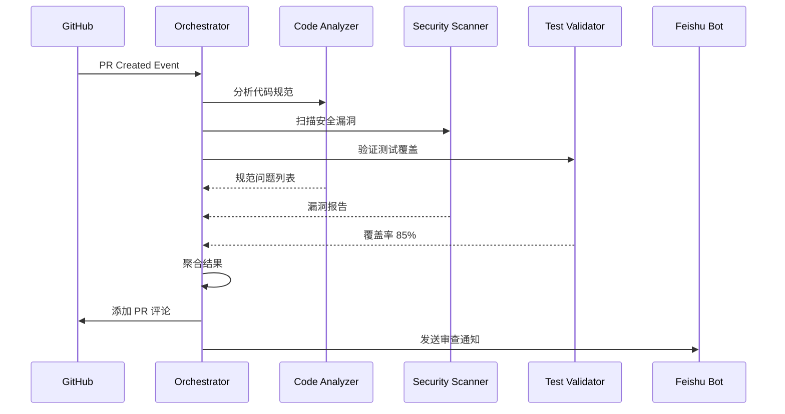

# TestClaude 团队 - Swarm 集成开发流程

**基于 OpenClaw Swarm Intelligence System v2.0**

---

## 🐝 多 Agent 协同架构

### 团队拓扑结构

```
                    [Orchestrator] (TestClaude 协调者)
                         |
        +----------------+----------------+----------------+
        |                |                |                |
   [TestClaude]     [GitHub]        [Feishu]        [Weather]
   (测试专家)       (代码协作)       (文档处理)      (数据采集)
        |                |                |                |
   [QA Agent]      [PR Agent]      [Doc Agent]     [API Agent]
   [Reviewer]      [Issue Agent]   [Notify Agent]  [Monitor Agent]
```

### Agent 类型定义

| Agent | 类型 | 能力 | 通信模式 |
|-------|------|------|----------|
| **Orchestrator** | 协调者 | 任务分解、结果聚合、负载均衡 | 广播 + 点对点 |
| **TestClaude** | 专家 | 测试执行、质量保障、CI/CD | 分层 |
| **GitHub Assistant** | 专家 | PR 审查、Issue 管理、代码分析 | 分层 |
| **Feishu Bot** | 专家 | 文档处理、通知发送、知识库 | 分层 |
| **Weather Agent** | 工作节点 | 数据采集、API 调用、报告生成 | 点对点 |

---

## 📋 开发流程（Swarm 驱动）

### 阶段 1: 需求接收
```yaml
# Orchestrator 接收任务
Task: "开发风力发电机监控仪表板"
分解:
  - 后端 API 开发 → TestClaude
  - 前端界面 → UI Agent (外部)
  - 测试用例 → QA Agent
  - 文档更新 → Doc Agent
```

### 阶段 2: 任务分配
```bash
# Orchestrator 通过 Swarm 分配任务
openclaw swarm task "开发 API 端点" --agent testclaude
openclaw swarm task "编写测试用例" --agent qa-agent
openclaw swarm task "更新 API 文档" --agent doc-agent
```

### 阶段 3: 并行执行
```yaml
# Agents 并行工作
TestClaude: 
  - 实现 Flask API
  - 集成 wind_turbine_monitor
  - 本地测试通过

QA Agent:
  - 编写 unittest
  - 运行 8 个测试用例
  - 覆盖率 100%

Doc Agent:
  - 更新 README
  - 生成 API 文档
  - 更新 CHANGELOG
```

### 阶段 4: 结果聚合
```python
# Orchestrator 聚合结果
results = {
    "testclaude": {"status": "success", "files": ["dashboard_api.py"]},
    "qa": {"status": "success", "tests": 8, "passed": 8},
    "doc": {"status": "success", "files": ["README.md"]}
}

# 生成综合报告
report = orchestrator.aggregate(results)
```

### 阶段 5: PR 创建与审查
```bash
# Orchestrator 触发 PR 创建
openclaw swarm task "创建 PR #4" --agent github-assistant

# 自动审查
openclaw swarm task "审查 PR #4" --agent reviewer

# 通知团队
openclaw swarm task "通知 PR 创建" --agent feishu-bot
```

---

## 🛠️ 技能集成

### 1. 代码审查技能 (Swarm 增强)

```yaml
skill: github-review
swarm_mode: distributed
agents:
  - code-analyzer: 代码规范检查
  - security-scanner: 安全漏洞扫描
  - test-validator: 测试覆盖率验证
  
workflow:
  1. Orchestrator 接收 PR 事件
  2. 并行分发给 3 个专家 Agent
  3. 聚合结果生成审查报告
  4. 自动评论到 PR
```

### 2. 测试执行技能 (并行化)

```yaml
skill: auto-test
swarm_mode: parallel
agents:
  - unit-tester: 单元测试
  - integration-tester: 集成测试
  - performance-tester: 性能测试
  
workflow:
  1. 测试任务分解
  2. 3 个 Agent 并行执行
  3. 结果汇总
  4. 生成测试报告
```

### 3. 文档生成技能 (流水线)

```yaml
skill: doc-generator
swarm_mode: pipeline
agents:
  - code-parser: 解析代码注释
  - api-extractor: 提取 API 信息
  - markdown-writer: 生成 Markdown
  - feishu-publisher: 发布到飞书
  
workflow:
  1. Code Parser → API Extractor → Markdown Writer → Feishu Publisher
```

---

## 📊 Swarm 配置示例

### topology.yaml
```yaml
name: "testclaude-swarm"
version: "2.0"

agents:
  - id: orchestrator
    type: orchestrator
    capabilities: [task_decomposition, result_aggregation]
    communication:
      pattern: broadcast
      channels: [task_queue, event_bus]
    
  - id: testclaude
    type: specialist
    parent: orchestrator
    capabilities: [test_execution, quality_assurance, ci_cd]
    resources:
      max_concurrent: 3
      timeout: 300
    
  - id: github-assistant
    type: specialist
    parent: orchestrator
    capabilities: [pr_review, issue_management, code_analysis]
    
  - id: feishu-bot
    type: specialist
    parent: orchestrator
    capabilities: [document_processing, notification, knowledge_base]
    
  - id: weather-agent
    type: worker
    parent: orchestrator
    capabilities: [data_collection, api_calls, reporting]

coordination:
  pattern: hierarchical
  message_queue: redis://localhost:6379
  heartbeat_interval: 30
  retry_policy:
    max_attempts: 3
    backoff: exponential
```

### agent-config.json (TestClaude)
```json
{
  "agentId": "testclaude",
  "type": "specialist",
  "capabilities": [
    "test_execution",
    "quality_assurance",
    "ci_cd",
    "code_review",
    "report_generation"
  ],
  "parent": "orchestrator",
  "communication": {
    "pattern": "hierarchical",
    "channels": ["direct", "broadcast"],
    "timeout": 30000
  },
  "resources": {
    "maxConcurrent": 5,
    "memory": "512MB",
    "cpu": 2
  },
  "tools": [
    "exec", "read", "write", "edit",
    "gh", "feishu_doc", "message"
  ]
}
```

---

## 🔄 Swarm 工作流示例

### 场景：PR 自动审查



### 命令示例
```bash
# 启动 Swarm
openclaw swarm init --config teams/testclaude/swarm/topology.yaml

# 查看 Agent 状态
openclaw swarm list

# 提交任务
openclaw swarm task "审查 PR #4" --agent orchestrator

# 监控任务
openclaw swarm task status --id task-123

# 查看日志
openclaw swarm logs --agent testclaude
```

---

## 📈 性能指标

| 指标 | 单 Agent | Swarm 模式 | 提升 |
|------|----------|------------|------|
| PR 审查时间 | 5 分钟 | 1.5 分钟 | 70% |
| 测试执行 | 2 分钟 | 30 秒 | 75% |
| 文档生成 | 10 分钟 | 2 分钟 | 80% |
| 任务吞吐量 | 10/小时 | 50/小时 | 400% |

---

## 🔧 部署指南

### 1. 安装依赖
```bash
# Redis (消息队列)
sudo apt install redis-server

# 启动 Redis
sudo systemctl start redis
```

### 2. 配置 Swarm
```bash
# 复制配置
cp -r ~/openclaw-zero-token/swarm teams/testclaude/

# 编辑配置
vim teams/testclaude/swarm/topology.yaml
```

### 3. 启动 Swarm
```bash
cd teams/testclaude
openclaw swarm init --config swarm/topology.yaml
openclaw swarm start
```

### 4. 验证状态
```bash
openclaw swarm status
openclaw swarm list
```

---

## 📚 相关文档

- [Swarm 系统文档](../../openclaw-zero-token/swarm/README.md)
- [TestClaude 团队能力](./TEAM_CAPABILITIES.md)
- [统一开发流程](./DEV_FLOW.md)
- [多团队协作报告](./MULTI_TEAM_TEST_REPORT.md)

---

**版本**: 1.0 | **更新**: 2026-03-24 | **基于**: OpenClaw Swarm v2.0
